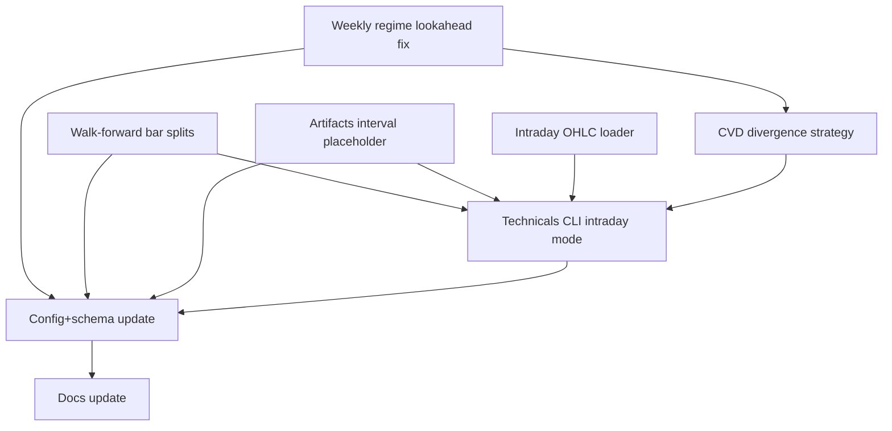

# CVD/Price Divergence + MSB (Intraday, Multi-Timeframe, Walk-Forward)

- **Status:** completed (2026-03-01)
- **Effort:** L
- **Alpha potential:** Med–High

## Overview
Implement a **long (v1)** strategy that detects **hidden bullish divergence** (“absorption”): **Price makes higher swing lows** while **CVD proxy makes lower lows**, then enters when **market structure breaks up** (close-confirmed). The strategy runs on **intraday OHLCV** built from the existing **Alpaca IntradayStore** (`data/intraday`) and supports:
- multiple target timeframes (e.g., `15m`, `30m`, `1h`) via resampling
- parameter optimization (`Backtest.optimize`)
- **walk-forward optimization** using **bar-count splits** (required for intraday)
- **lookahead-safe weekly regime filter** (prior completed week only)

Outputs are offline artifacts and reports (**not financial advice**).

## Prerequisites
- Existing repo deps: `backtesting.py`, `ta`, `pandas`, `numpy`
- Intraday data captured via `options-helper intraday pull-stocks-bars` (timeframe `1Min` or `5Min`) into an IntradayStore directory (default `data/intraday`)

## Decisions locked in
- **CVD definition**: `delta = Volume * sign(Close − Open)`; `CVD = cumsum(delta)`
- **CVD reset**: continuous across bars; use EMA detrend + rolling z-score
- **Swings**: swing lows from `Low`, swing highs from `High`
- **Entry trigger**: **Close** breaks structure level (not High)
- **Exits**: ATR stop + ATR take-profit + optional time stop
- **Timeframes**: intraday backtests with optional weekly filter; run by choosing `--interval`
- **Interval policy**: whitelist common intervals; normalize to canonical
- **Weekly filter (no-lookahead)**: **prior completed week only**
- **Timezone**: treat tz-naive timestamps as **UTC**; resample boundaries are UTC-based
- **Missing data strictness**: **warn + continue**, record coverage in artifacts (no hard fail)

## Public interfaces / behavior changes

### 1) Weekly regime semantics change (lookahead fix)
- `options_helper/technicals_backtesting/indicators/provider_ta.py` will make `weekly_trend_up` **shifted by 1 weekly bar** before forward-fill, so it only applies starting the *next* week (prior completed week).
- This affects existing strategy filters and weekly trend reporting but removes lookahead bias.

### 2) Walk-forward config expansion
- Add optional bar-count fields in `walk_forward`: `min_history_bars`, `train_bars`, `validate_bars`, `step_bars`.
- If bar fields are present, walk-forward uses bar-based splits; otherwise date-based splits (but date-based logic will be made intraday-safe too).

### 3) New strategy
- `CvdDivergenceMSB` added under technicals_backtesting strategies and exposed through existing `options-helper technicals optimize/walk-forward/run-all`.

### 4) Technicals CLI additions
- Add intraday input mode via `--intraday-dir`, `--intraday-timeframe`, `--intraday-start`, `--intraday-end`.
- Add `--interval` (target timeframe) with whitelist validation for intraday mode.

### 5) Artifacts namespacing by interval
- Artifact writer supports `{interval}` placeholder in templates and includes `interval` + intraday coverage metadata in params payload.

### 6) Candle cache safety
- `options_helper/data/candles.py` meta matching includes `interval` to prevent mixed-interval merges when reusing cache dirs.

## Strategy spec (implementation-ready)

### Inputs
CandleFrame with `Open`, `High`, `Low`, `Close`, `Volume`, `DatetimeIndex` (tz-naive treated as UTC).

### Derived series (causal)
- `delta[t] = Volume[t] * sign(Close[t] − Open[t])`, with doji → `0`
- `cvd = cumsum(delta)` starting at 0
- `cvd_ema = EMA(cvd, span=cvd_smooth_span)`
- `cvd_osc = cvd − cvd_ema`
- `cvd_z = zscore(cvd_osc, window=cvd_z_window)` (std=0 → NaN)

### Pivot swings (confirmed)
Parameters: `pivot_left`, `pivot_right`
- Swing low at pivot index `k` if `Low[k]` is min vs left/right neighbors.
- Pivot becomes **knowable** only at `confirm_idx = k + pivot_right`.
- Strategy must only consume pivots after confirmation (no lookahead).

### Hidden bullish divergence setup (on confirmed pivot2)
Parameters: `divergence_window_bars`, `min_separation_bars`, `min_price_delta_pct`, `min_cvd_z_delta`, `max_setup_age_bars`, `msb_min_distance_bars`

At a confirmed swing low pivot2:
1) Choose pivot1 = most recent prior swing low within window and separation.
2) Price higher-low: `Low[pivot2] >= Low[pivot1] * (1 + min_price_delta_pct/100)`
3) CVD lower-low: `cvd_z[pivot2] <= cvd_z[pivot1] − min_cvd_z_delta` (NaN → no setup)
4) Structure break level:
   - `break_level = max(High[pivot1 : pivot2])` (slice uses pivot indices, not confirmation indices)
   - `break_level_idx = argmax(...)` for distance gating
5) Setup invalidation + expiry:
   - Invalidate if `Low[t] < Low[pivot2]`
   - Expire after `max_setup_age_bars`
   - Single active setup; newer valid setup replaces older

### Entry
If not in position and have active setup:
- Optional weekly filter: `weekly_trend_up == True` (lookahead-safe)
- Enter long when:
  - `Close[t] > break_level` (close-confirmed)
  - `(t − break_level_idx) >= msb_min_distance_bars`
- Use `self.buy(sl=..., tp=...)` so fills occur next bar open when `trade_on_close=False`.

### Exit
Parameters: `atr_window`, `stop_mult_atr`, `take_profit_mult_atr`, `max_holding_bars`
- On entry: `sl = entry − stop_mult_atr * ATR`, `tp = entry + take_profit_mult_atr * ATR`
- Time stop: close if holding bars >= `max_holding_bars`

### Fail-soft rules
- Missing `Volume` column or non-finite volume values: warn and do not enter trades (no crash).
- NaN ATR at entry: skip entry.

## Dependency graph (high level)

## Tasks (dependency-aware)

### T1: Fix weekly regime lookahead bias
- **status**: completed (2026-03-01)
- **depends_on**: []
- **location**:
  - `options_helper/technicals_backtesting/indicators/provider_ta.py`
  - `tests/test_technical_backtesting_indicators.py`
- **description**:
  - Change weekly regime so `weekly_fast`, `weekly_slow`, and `trend` are computed on weekly bars then **shift(1)** before reindex/ffill to the base frame.
  - Keep column names the same (`weekly_trend_up`, `weekly_sma_*`) so existing strategies automatically become lookahead-safe.
  - Update indicator tests to assert behavior consistent with “prior completed week”.
- **validation**:
  - `pytest -k technical_backtesting_indicators`
- **work_log**:
  - Shifted weekly SMA/trend series by one completed weekly bar before base-frame forward fill to enforce prior-week semantics.
  - Preserved existing output columns (`weekly_trend_up`, `weekly_sma_*`) for backward compatibility.
  - Added/updated indicator regression expectations for prior-completed-week behavior.
  - Validation: `./.venv/bin/python -m pytest -k technical_backtesting_indicators` and combined wave check passed.
  - Files: `options_helper/technicals_backtesting/indicators/provider_ta.py`, `tests/test_technical_backtesting_indicators.py`.
  - Gotchas: none.

### T2: Add intraday-safe walk-forward splits + bar-count mode
- **status**: completed (2026-03-01)
- **depends_on**: []
- **location**:
  - `options_helper/technicals_backtesting/backtest/walk_forward.py`
  - `tests/test_technical_backtesting_walk_forward.py`
- **description**:
  - Refactor splits to operate on **bar positions** (not `train_end + 1 day`) so intraday doesn’t create gaps/empty validate windows.
  - Add optional config support:
    - `walk_forward.min_history_bars`
    - `walk_forward.train_bars`
    - `walk_forward.validate_bars`
    - `walk_forward.step_bars`
  - Precedence: if `train_bars` is set and >0, bar-based splits are used; otherwise date-based splits.
  - Ensure viability checks apply **after warmup** trimming.
  - Add a test that would fail under old `+1 day` logic (intraday index).
- **validation**:
  - `pytest -k technical_backtesting_walk_forward`
- **work_log**:
  - Refactored split construction to contiguous bar-position windows for intraday-safe training/validation boundaries.
  - Added bar-count fields (`min_history_bars`, `train_bars`, `validate_bars`, `step_bars`) with precedence to bar mode when `train_bars > 0`.
  - Kept date-based behavior available while removing intraday `+1 day` gap assumptions.
  - Added regression coverage for intraday contiguous folds and warmup-order viability checks.
  - Validation: `./.venv/bin/python -m pytest -k technical_backtesting_walk_forward` and combined wave check passed.
  - Files: `options_helper/technicals_backtesting/backtest/walk_forward.py`, `tests/test_technical_backtesting_walk_forward.py`.
  - Gotchas: none.

### T3: Support `{interval}` in technical-backtesting artifacts
- **status**: completed (2026-03-01)
- **depends_on**: []
- **location**:
  - `options_helper/data/technical_backtesting_artifacts.py`
  - `tests/` (new unit test)
- **description**:
  - Extend artifact path rendering to accept an `interval` token and substitute `{interval}` if present.
  - Include `interval` in the params payload (under `data`).
  - Backward compatible: templates without `{interval}` continue to work.
- **validation**:
  - `pytest -k technical_backtesting_artifacts`
- **work_log**:
  - Added optional `interval` threading to artifact path rendering and writer entrypoints, including `{interval}` template substitution.
  - Ensured backward compatibility for templates without interval placeholders.
  - Included `data.interval` in params payload with explicit/fallback resolution.
  - Added dedicated artifact unit tests for interval placeholder substitution and payload behavior.
  - Validation: `./.venv/bin/python -m pytest -k technical_backtesting_artifacts` and combined wave check passed.
  - Files: `options_helper/data/technical_backtesting_artifacts.py`, `tests/test_technical_backtesting_artifacts.py`.
  - Gotchas: none.

### T4: Candle cache meta matching includes interval
- **status**: completed (2026-03-01)
- **depends_on**: []
- **location**:
  - `options_helper/data/candles.py`
  - `tests/test_candles_cache.py`
- **description**:
  - Update `_meta_matches_settings` to also enforce `interval` match (case-insensitive) so caches can’t mix `1d` and `1h`.
  - Add/extend regression test proving a mismatched interval forces a refetch/reset path rather than merging.
- **validation**:
  - `pytest -k candles_cache`
- **work_log**:
  - Extended candle cache meta matching to include case-insensitive interval equivalence checks.
  - Added regression to prove interval mismatch triggers reset/refetch behavior instead of cache merge.
  - Added case-insensitive compatibility test (`1D` vs `1d`) to retain expected matching behavior.
  - Validation: `./.venv/bin/python -m pytest -k candles_cache` and combined wave check passed.
  - Files: `options_helper/data/candles.py`, `tests/test_candles_cache.py`.
  - Gotchas: none.

### T5: Implement intraday OHLCV loader from IntradayStore
- **status**: completed (2026-03-01)
- **depends_on**: []
- **location**:
  - `options_helper/data/technical_backtesting_intraday.py` (new)
  - `tests/` (new unit test)
- **description**:
  - Load partitions: `kind="stocks"`, `dataset="bars"`, `timeframe in {"1Min","5Min"}` for `symbol` over `[start_day, end_day]`.
  - Warn+skip missing/empty partitions; collect coverage metadata.
  - Normalize to CandleFrame and resample to target interval with correct OHLCV aggregation.
  - Validate target interval is >= base timeframe and integer multiple; raise on invalid.
- **validation**:
  - `pytest -k intraday`
- **work_log**:
  - Added new intraday loader module for `IntradayStore` bars (`stocks/bars`, `1Min|5Min`) with inclusive day-range loading.
  - Implemented warn+continue behavior for missing/empty/read-failed partitions and emitted coverage metadata.
  - Normalized rows into CandleFrame-compatible OHLCV and added interval-multiple validation + OHLCV resampling.
  - Added deterministic tests for resampling correctness, missing/empty coverage accounting, and invalid interval errors.
  - Validation: `./.venv/bin/python -m pytest -k intraday` and combined wave check passed.
  - Files: `options_helper/data/technical_backtesting_intraday.py`, `tests/test_technical_backtesting_intraday.py`.
  - Gotchas: none.

### T6: Implement `CvdDivergenceMSB` strategy + integration points
- **status**: completed (2026-03-01)
- **depends_on**: [T1]
- **location**:
  - `options_helper/technicals_backtesting/strategies/cvd_divergence_msb.py` (new)
  - `options_helper/technicals_backtesting/strategies/registry.py`
  - `options_helper/technicals_backtesting/feature_selection.py`
  - `tests/` (new strategy tests)
- **description**:
  - Implement the strategy spec using `Strategy.buy(sl=..., tp=...)`.
  - Ensure pivot confirmation is implemented without lookahead (pivot vs confirmation index separation).
  - Register strategy name `"CvdDivergenceMSB"` in registry.
  - Update required feature columns (`atr_*`, `weekly_trend_up`).
  - Add tests that assert entry timing (no early entry) and fail-soft on missing Volume.
- **validation**:
  - `pytest -k cvd_divergence`
- **work_log**:
  - Added new `CvdDivergenceMSB` strategy module implementing hidden bullish divergence setup, close-confirmed MSB entry, ATR exits, and optional time stop.
  - Implemented causal pivot confirmation logic and setup lifecycle (replace/invalidate/expiry) to avoid lookahead.
  - Registered `CvdDivergenceMSB` in strategy registry and added strategy-specific required features.
  - Added deterministic strategy tests covering no-early-entry behavior and fail-soft missing-volume handling.
  - Validation: `./.venv/bin/python -m pytest -k cvd_divergence` and follow-up `-k "cvd_divergence or technical_backtesting_indicators"` passed.
  - Files: `options_helper/technicals_backtesting/strategies/cvd_divergence_msb.py`, `options_helper/technicals_backtesting/strategies/registry.py`, `options_helper/technicals_backtesting/feature_selection.py`, `tests/test_cvd_divergence_strategy.py`.
  - Gotchas: none.

### T7: Wire intraday mode + interval into technicals CLI
- **status**: completed (2026-03-01)
- **depends_on**: [T2, T3, T5, T6]
- **location**:
  - `options_helper/commands/technicals/backtesting.py`
  - `tests/` (new CLI test)
- **description**:
  - Add `--interval` and intraday options (`--intraday-dir`, `--intraday-timeframe`, `--intraday-start`, `--intraday-end`).
  - Data source precedence:
    1) `--ohlc-path`
    2) `--intraday-dir`
    3) `--symbol --cache-dir`
  - Thread `interval` into artifact writing and include coverage metadata in `data_meta`.
- **validation**:
  - `pytest -k technicals`
- **work_log**:
  - Added `--interval`, `--intraday-dir`, `--intraday-timeframe`, `--intraday-start`, `--intraday-end` to technical backtesting command paths (`optimize`, `walk-forward`, `run-all`).
  - Implemented OHLC source precedence: `--ohlc-path` first, then intraday store loader, then symbol/cache candle loader.
  - Wired interval through artifact writing paths and added intraday coverage metadata under `data_meta.intraday_coverage`.
  - Added deterministic CLI tests for precedence behavior, interval threading, and intraday coverage propagation.
  - Validation: `./.venv/bin/python -m pytest -k technicals` and follow-up `-k "technical_backtesting_cli or technicals"` passed.
  - Files: `options_helper/commands/technicals/backtesting.py`, `tests/test_technical_backtesting_cli.py`.
  - Gotchas: none.

### T0: Update config + JSON schema
- **status**: completed (2026-03-01)
- **depends_on**: [T1, T2, T3, T7]
- **location**:
  - `config/technical_backtesting.yaml`
  - `config/technical_backtesting.schema.json`
  - `options_helper/data/technical_backtesting_config.py`
- **description**:
  - Add `CvdDivergenceMSB` strategy block (disabled by default).
  - Add walk-forward bar split fields to config + schema.
  - Update artifact templates to include `{interval}`.
- **validation**:
  - `pytest -k technical_backtesting_config`
- **work_log**:
  - Added `CvdDivergenceMSB` strategy block to default config (disabled by default) with defaults, search space, and constraints.
  - Added walk-forward bar-count fields (`min_history_bars`, `train_bars`, `validate_bars`, `step_bars`) across config + JSON schema.
  - Updated artifact path templates in config to include `{interval}` placeholder support.
  - Hardened config loader validation for bar-mode invariants and compatibility boundaries.
  - Added/updated config tests to cover new strategy block and bar-field validation semantics.
  - Validation: `./.venv/bin/python -m pytest -k technical_backtesting_config` passed.
  - Files: `config/technical_backtesting.yaml`, `config/technical_backtesting.schema.json`, `options_helper/data/technical_backtesting_config.py`, `tests/test_technical_backtesting_config.py`.
  - Gotchas: none.

### T8: Docs updates
- **status**: completed (2026-03-01)
- **depends_on**: [T0, T5, T6, T7]
- **location**:
  - `docs/technical_backtesting/CVD_DIVERGENCE_MSB.md` (new)
  - `docs/technical_backtesting/INDICATORS.md`
  - `docs/technical_backtesting/RUNBOOK.md`
  - `docs/technical_backtesting/CONFIG_SCHEMA.md`
  - `docs/technical_backtesting/DATA_CONTRACTS.md`
- **description**:
  - Document strategy, intraday workflow, no-lookahead rules, UTC assumptions, and caveats (not financial advice).
- **validation**:
  - `pytest -k docs` (if present)
- **work_log**:
  - Added dedicated strategy doc `CVD_DIVERGENCE_MSB.md` covering setup/entry/exit logic, fail-soft rules, lookahead safeguards, and UTC assumptions.
  - Updated indicator, runbook, config-schema, and data-contract docs to reflect intraday CLI mode, interval-aware artifacts, prior-week weekly regime semantics, and intraday coverage metadata.
  - Added explicit decision-support/non-financial-advice caveats and CLI examples aligned with implemented command flags.
  - Validation: `./.venv/bin/python -m pytest -k docs` passed.
  - Files: `docs/technical_backtesting/CVD_DIVERGENCE_MSB.md`, `docs/technical_backtesting/INDICATORS.md`, `docs/technical_backtesting/RUNBOOK.md`, `docs/technical_backtesting/CONFIG_SCHEMA.md`, `docs/technical_backtesting/DATA_CONTRACTS.md`.
  - Gotchas: none.

## Parallel execution groups

| Wave | Tasks | Can Start When |
|------|-------|----------------|
| 1 | T1, T2, T3, T4, T5 | Immediately |
| 2 | T6 | T1 complete |
| 3 | T7 | T2, T3, T5, T6 complete |
| 4 | T0 | T1, T2, T3, T7 complete |
| 5 | T8 | T0, T5, T6, T7 complete |

## Testing strategy
- Unit-level first: weekly regime regression, walk-forward bar splits, intraday loader resample correctness, strategy entry timing.
- Then CLI validation tests.
- Finally full suite: `python -m pytest`.

## Risks & mitigations
- **Lookahead bugs (pivots/weekly)**: lock with targeted regression tests (T1, T6).
- **Intraday data gaps**: warn+continue but record coverage; strict mode can be added later.
- **Search space explosion**: keep `CvdDivergenceMSB.search_space` small; recommend `method="sambo"` for larger spaces.
- **Timezone confusion**: codify “naive==UTC” and document; avoid session logic in v1.
